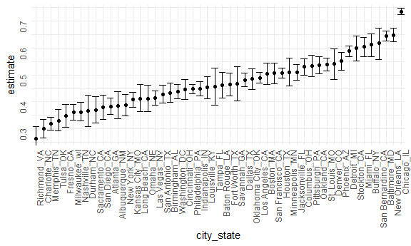
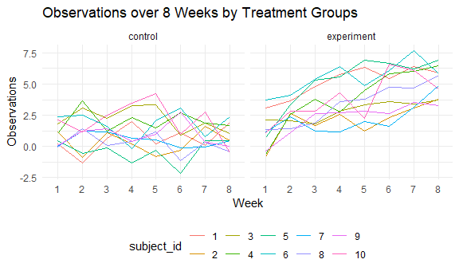

P8105-hw5-zc2556
================
Zhe Chen
2020/11/17

## Problem 1

### Libraries and Basics

### Import and Clean the Data Set

``` r
#read in the dataset
homoicide = 
  read_csv("./homicide-data.csv") %>%
  #redefine the arrest status
  mutate(
    city_state = str_c(city, state, sep = "_"),
    resolved = case_when(
      disposition == "Closed without arrest" ~ "unsolved",
      disposition == "Open/No arrest"        ~ "unsolved",
      disposition == "Closed by arrest"      ~ "solved"
    )
  ) %>%
  select(
    city_state,resolved
  ) %>%
  filter(city_state != "Tulsa_AL")
```

    ## Parsed with column specification:
    ## cols(
    ##   uid = col_character(),
    ##   reported_date = col_double(),
    ##   victim_last = col_character(),
    ##   victim_first = col_character(),
    ##   victim_race = col_character(),
    ##   victim_age = col_character(),
    ##   victim_sex = col_character(),
    ##   city = col_character(),
    ##   state = col_character(),
    ##   lat = col_double(),
    ##   lon = col_double(),
    ##   disposition = col_character()
    ## )

Check the data set

``` r
#give a tidy data frame including the solved/unsolved cases 
aggregate_homo = 
  homoicide %>%
  group_by(city_state) %>%
  summarize(
    hom_total = n(),
    hom_unsolved = sum(resolved == "unsolved")
  )
```

    ## `summarise()` ungrouping output (override with `.groups` argument)

``` r
aggregate_homo
```

    ## # A tibble: 50 x 3
    ##    city_state     hom_total hom_unsolved
    ##    <chr>              <int>        <int>
    ##  1 Albuquerque_NM       378          146
    ##  2 Atlanta_GA           973          373
    ##  3 Baltimore_MD        2827         1825
    ##  4 Baton Rouge_LA       424          196
    ##  5 Birmingham_AL        800          347
    ##  6 Boston_MA            614          310
    ##  7 Buffalo_NY           521          319
    ##  8 Charlotte_NC         687          206
    ##  9 Chicago_IL          5535         4073
    ## 10 Cincinnati_OH        694          309
    ## # ... with 40 more rows

Prop test for a single city

``` r
prop.test(
  aggregate_homo %>% filter(city_state == "Baltimore_MD") %>% pull(hom_unsolved),
  aggregate_homo %>% filter(city_state == "Baltimore_MD") %>% pull(hom_total)
  ) %>%
  broom::tidy() #make it exhibit in one row
```

    ## # A tibble: 1 x 8
    ##   estimate statistic  p.value parameter conf.low conf.high method    alternative
    ##      <dbl>     <dbl>    <dbl>     <int>    <dbl>     <dbl> <chr>     <chr>      
    ## 1    0.646      239. 6.46e-54         1    0.628     0.663 1-sample~ two.sided

Iterate

``` r
#using map to give prop tests of each city state
results =
  aggregate_homo %>%
  mutate(
    prop_test = map2(.x = hom_unsolved, .y = hom_total, ~prop.test(x = .x, n = .y)),
    tidy_test = map(.x = prop_test, ~broom::tidy(.x))
  ) %>%
  select(
    -prop_test
  ) %>%
  unnest(tidy_test) %>%
  select(
    city_state, estimate, conf.low, conf.high
  )
results
```

    ## # A tibble: 50 x 4
    ##    city_state     estimate conf.low conf.high
    ##    <chr>             <dbl>    <dbl>     <dbl>
    ##  1 Albuquerque_NM    0.386    0.337     0.438
    ##  2 Atlanta_GA        0.383    0.353     0.415
    ##  3 Baltimore_MD      0.646    0.628     0.663
    ##  4 Baton Rouge_LA    0.462    0.414     0.511
    ##  5 Birmingham_AL     0.434    0.399     0.469
    ##  6 Boston_MA         0.505    0.465     0.545
    ##  7 Buffalo_NY        0.612    0.569     0.654
    ##  8 Charlotte_NC      0.300    0.266     0.336
    ##  9 Chicago_IL        0.736    0.724     0.747
    ## 10 Cincinnati_OH     0.445    0.408     0.483
    ## # ... with 40 more rows

Plot

``` r
results %>%
  mutate(city_state = fct_reorder(city_state, estimate)) %>%
  ggplot(aes(x = city_state, y = estimate)) +
  geom_point()+
  geom_errorbar(ymin = results$conf.low, ymax = results$conf.high)+
  theme(axis.text = element_text(angle = 90, vjust = 0.5, hjust = 1))
```



## Problem 2

### Import Data Sets with Iteration

``` r
#store file paths of the control data sets
path_con = 
  str_c("./data/", list.files("data", pattern = "con"))

#store file paths of the experiment data sets 
path_exp = 
  str_c("./data/", list.files("data", pattern = "exp"))

#import both controls and experiments into a single data set
long_data = 
  tibble(
    control = map(path_con, read_csv),
    experiment = map(path_exp, read_csv)
  )

path_con = 
  str_c("./data/", list.files("data", pattern = "con"))

path_exp = 
  str_c("./data/", list.files("data", pattern = "exp"))

long_data = 
  tibble(
    control = map(path_con, read_csv),
    experiment = map(path_exp, read_csv)
  )
```

### Make the Data Tidy

``` r
#make it tidy
long_data_tidy = 
  long_data %>%
  mutate(
    subject_id = 1:10
  ) %>%
  pivot_longer(
    control:experiment,
    names_to = "arm"
  ) %>%
  unnest() %>%
  pivot_longer(
    week_1:week_8,
    names_to = "week",
    names_prefix = "week_",
    values_to = "observations"
  )
```

    ## Warning: `cols` is now required when using unnest().
    ## Please use `cols = c(value)`

``` r
long_data_tidy
```

    ## # A tibble: 160 x 4
    ##    subject_id arm        week  observations
    ##         <int> <chr>      <chr>        <dbl>
    ##  1          1 control    1             0.2 
    ##  2          1 control    2            -1.31
    ##  3          1 control    3             0.66
    ##  4          1 control    4             1.96
    ##  5          1 control    5             0.23
    ##  6          1 control    6             1.09
    ##  7          1 control    7             0.05
    ##  8          1 control    8             1.94
    ##  9          1 experiment 1             3.05
    ## 10          1 experiment 2             3.67
    ## # ... with 150 more rows

### Plot

``` r
long_data_tidy %>%
  mutate(subject_id = as.factor(subject_id),
         week = as.factor(week)
         ) %>%
  ggplot(aes(x = week, y = observations, group = subject_id, color = subject_id)) +
  geom_path()+
  facet_grid(~arm) +
  labs(
    title = "Observations over 8 Weeks by Treatment Groups",
    x = "Week",
    y = "Observations"
  ) + 
  theme(legend.position = "bottom")
```



We made a spaghetti plot to show the observations on each subject over
time to compare the effect of the treatment. In control group, we don’t
observe a strong trend and the change of observations for 8 weeks seems
to be random. However, for the experiment group, we can observe a
clearly increasing tread, showing the treatment should have some effect
compared to the control.

## Problem 3

### Import and Clean the Data
